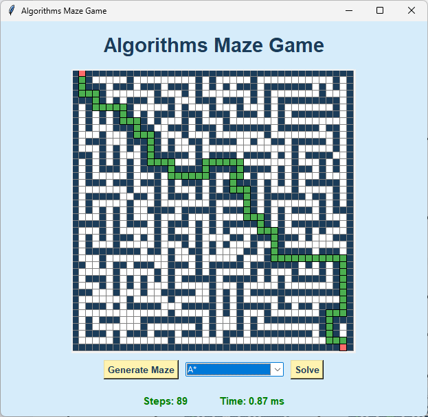

Algorithm Maze Game

A visual, interactive tool for generating mazes and exploring pathfinding algorithms.

## Overview

This project demonstrates maze generation and pathfinding algorithms with a visualizer. Use the GUI to generate mazes, run algorithms step-by-step, and compare performance and behavior.

## Screenshots

## Features

- Interactive maze generation
- Visual step-through of pathfinding algorithms
- Adjustable maze size and algorithm parameters
- Save/Load maze layouts (if implemented)

## Requirements

- Python 3.8+
- Recommended: create and use a virtual environment

## Installation

1. Clone the repository:

	git clone <repo-url>
2. Create and activate a virtual environment:

	python -m venv venv
	# Windows
	venv\\Scripts\\activate
	# macOS / Linux
	source venv/bin/activate
3. Install dependencies (if any):

	pip install -r requirements.txt

If there is no `requirements.txt`, the project may only require the Python standard library.

## Running

Start the application with:

	python main.py

If the project uses a different entry point, replace the above command accordingly.

## Usage

- Use the UI to generate a maze via `maze_generator.py`.
- Select a pathfinding algorithm from the options (see `algorithms.py`).
- Start the algorithm to watch it explore and find a path.
- Use controls to pause, step, or reset the visualization.

## Controls

- Generate Maze: (UI button)
- Start / Pause Algorithm: (UI button)
- Step Frame: (UI button)
- Reset: (UI button)

## Algorithms

See `algorithms.py` for the implemented algorithms. Add or edit this list to match the actual implementations. Example algorithms commonly included:

- Depth-First Search (DFS)
- Breadth-First Search (BFS)
- Dijkstra's Algorithm
- A* Search
- Greedy Best-First Search

## Project Structure

- `main.py` — Application entry point
- `visualizer.py` — UI and rendering logic
- `maze_generator.py` — Maze generation algorithms
- `algorithms.py` — Pathfinding algorithm implementations
- `README.md` — This file

## Contributing

Contributions are welcome. Fork the repo, create a branch, and open a pull request with a clear description of changes.

## License

Add your preferred license here (e.g., MIT). If unsure, include a `LICENSE` file in the repository.

## Contact

For issues or questions, open an issue on the repository or contact the project maintainer.
